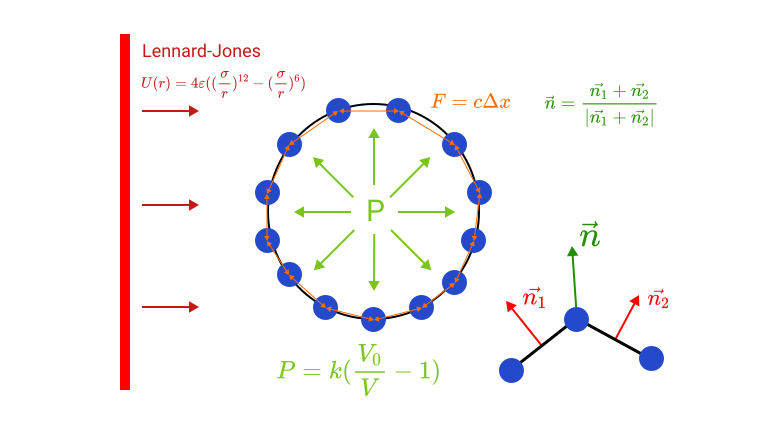

# Elastic collision simulation 

## Preview

## Model

## Warning
Be aware of input extreme or not physically correct model parameters.
If the model faces really extreme reaction forces it could possibly break up the system.
If the system went haywire reload the page or close the window.

## [Demo](https://ogthug-coder.github.io/math_model_hw/)
